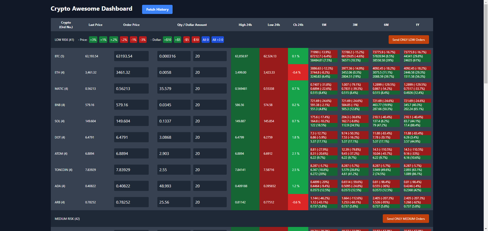

# Crypto Awesome Dashboard

## Overview

Crypto Awesome Dashboard is a comprehensive web application built with Laravel 11, Livewire 3, and Tailwind CSS. This dashboard is designed to manage and monitor cryptocurrency trading activities efficiently. The application currently supports Bitget, but it can be customized to work with other crypto exchanges such as Binance, OKEx, Bybit, and more.

## Features

- **Real-time Price Updates**: Displays the latest prices of various cryptocurrencies.
- **Order Management**: Allows users to place and manage orders directly from the dashboard.
- **Batch Order Execution**: Features buttons to execute multiple orders simultaneously.
- **Price and Dollar Amount Adjustment**: Provides buttons to increment or decrement the price and dollar amount.
- **Risk Classification**: Categorizes cryptocurrencies into different risk levels (Low, Medium, High).
- **Historical Data Fetching**: Fetches and displays historical data for cryptocurrencies.
- **Responsive Design**: Ensures a seamless experience across different devices.

## Screenshot

## Usage

### Dashboard Interface

- **Cryptocurrency List**: Displays a list of cryptocurrencies along with the number of orders.
- **Price Adjustment Buttons**: Increment or decrement the price by predefined percentages (e.g., +3%, +1%, -2%, -3%).
- **Dollar Amount Adjustment Buttons**: Increment or decrement the dollar amount by predefined values (e.g., +$10, +$5, -$5, -$10).
- **Order Execution Buttons**: Buttons like "Send ONLY LOW Orders" and "Send ONLY MEDIUM Orders" allow batch execution of orders based on risk classification.
- **Historical Data**: Fetches and displays historical price data for each cryptocurrency.

### Customization

The Crypto Awesome Dashboard is designed to be highly customizable. Here are some customization options:

- **Exchange Integration**: Currently supports Bitget, but can be extended to support Binance, OKEx, Bybit, and other exchanges.
- **Risk Classification**: Adjust risk levels and categories based on your criteria.
- **Order Types**: Implement additional order types (e.g., market orders, stop-loss orders) as needed.

## Technologies Used

- **Laravel 11**: A PHP framework for building robust web applications.
- **Livewire 3**: A full-stack framework for Laravel that makes building dynamic interfaces simple.
- **Tailwind CSS**: A utility-first CSS framework for designing responsive and modern UIs.
- **Exchange SDK**: For interacting with the exchanges.

## Contact

For more details or inquiries, please contact me at [arashkp@gmail.com](mailto:arashkp@gmail.com) or connect with me on [LinkedIn](https://www.linkedin.com/in/arashkp/).

This project is customized and available upon request.
